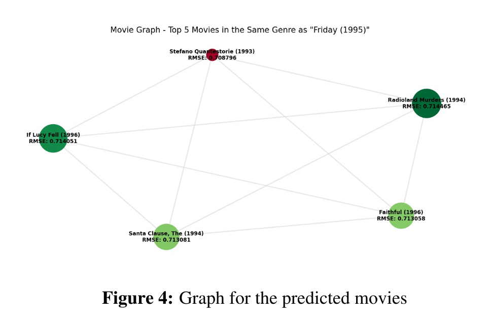
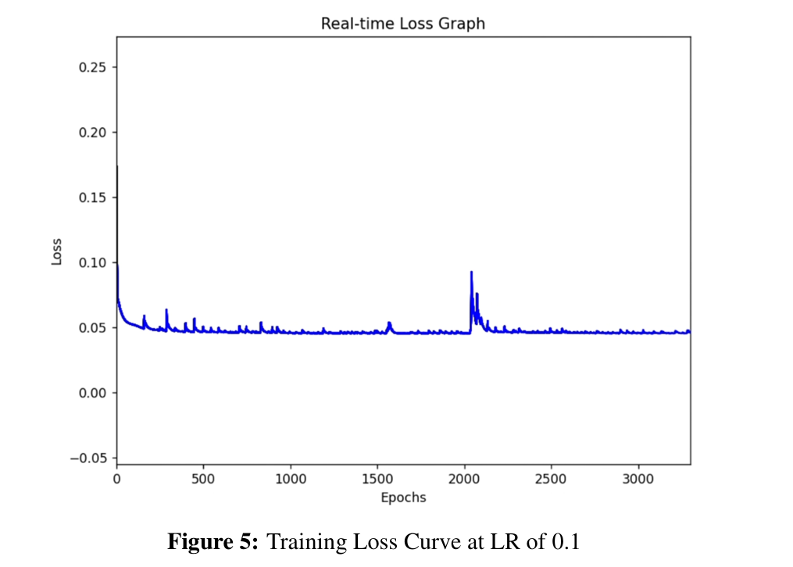
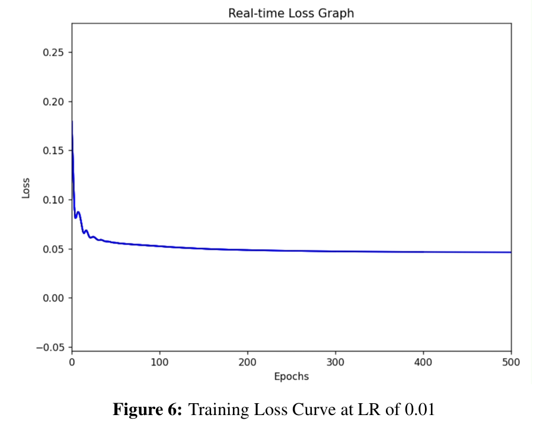
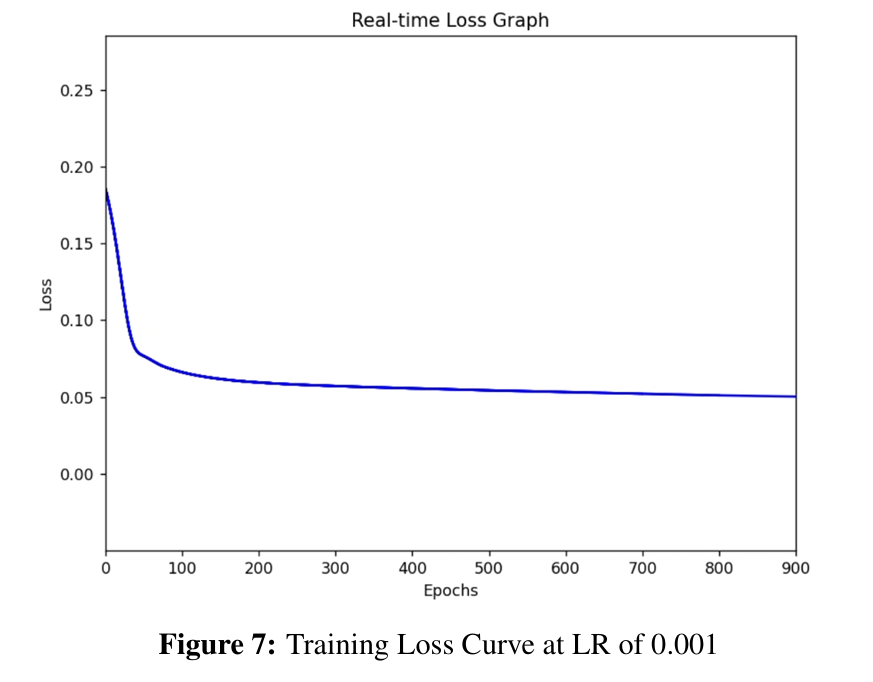

# Multi-Graph Graph Attention Network (MG-GAT)

This repository holds the Tensorflow-based implementation of Multi-Graph Graph Attention Network (MG-GAT) proposed in the [Interpretable Recommender System With Heterogeneous Information: A Geometric Deep Learning Perspective](http://dx.doi.org/10.2139/ssrn.3696092).  
We have added an extra feature of a Movie Recommendation System using graph-based indexing over MovieLens in the final implementation!

## Getting Started

We recommend using a conda virtual environment:
```
conda create -n mggat_env python=3.7
conda activate mggat_env
```
Install TensorFlow (your installation may vary):
```
conda install tensorflow-gpu==2.4.1
```
Pip install packages:
```
pip install ray==0.8.7 ray[tune] hyperopt pandas scikit-learn
```
To train our model on the MovieLens100K dataset, run:
```
python models.py
```
Check `models.py` to change arguments for model, dataset, etc.

---

## Paper

### Overview
Recommendation systems have become indispensable tools in the modern digital ecosystem, enabling platforms to offer personalized suggestions that enhance user experience and engagement. Graph Attention Networks (GATs) leverage attention mechanisms to prioritize the most relevant connections in a graph, making them particularly effective for handling complex relationships and dependencies in recommendation datasets.

This project integrates GATs into a movie recommendation system using the MovieLens 100K dataset. By analyzing curated metadata, including user reviews, the system identifies and recommends high-quality movies tailored to user preferences.

---

### Results
#### Output Examples:
1. **Top 5 Recommendations Based on RMSE Values**:
   - These reflect the closest relationships between the input movie and others in the dataset.

2. **Top 5 Genre-Specific Recommendations**:
   - This demonstrates the system’s capability to focus on genre-specific predictions.

#### Graphical Representation:
- Visualizes results for genre-specific recommendations using color gradients:
  - **Red**: Closest recommendation.
  - **Shades of Green**: Progressively less similar recommendations.



#### Training Loss Curves:
- The following plots show the training loss curves for different learning rates:

Learning Rate = 0.1:


Learning Rate = 0.01:


Learning Rate = 0.001:


#### Summary:
The GAT architecture dynamically focuses on relevant neighbors in the graph, achieving accurate predictions while minimizing error.

---

### References
If you use this code or build upon this work, please cite the following paper:
```
@article{leng2020interpretable,
  title={Interpretable recommender system with heterogeneous information: A geometric deep learning perspective},
  author={Leng, Yan and Ruiz, Rodrigo and Dong, Xiaowen and Pentland, Alex}
}
```


